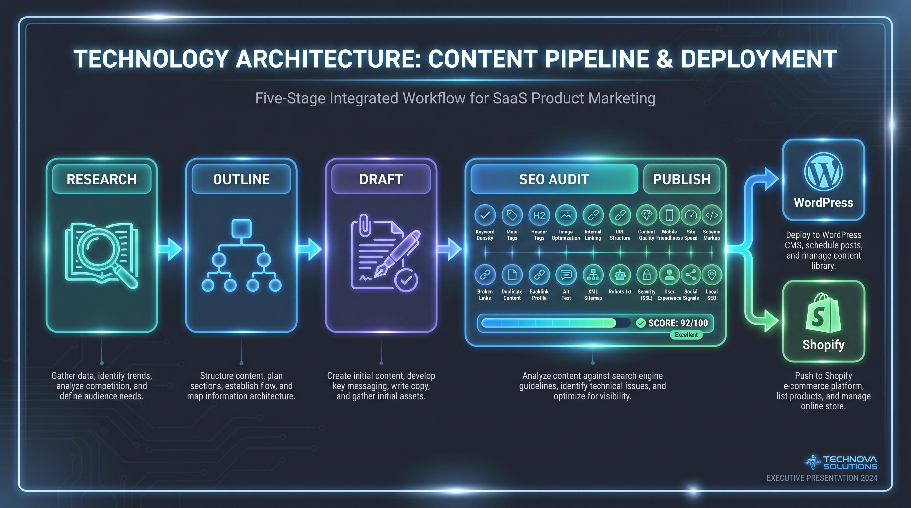
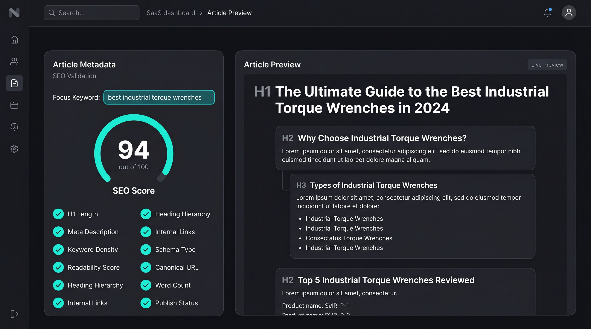
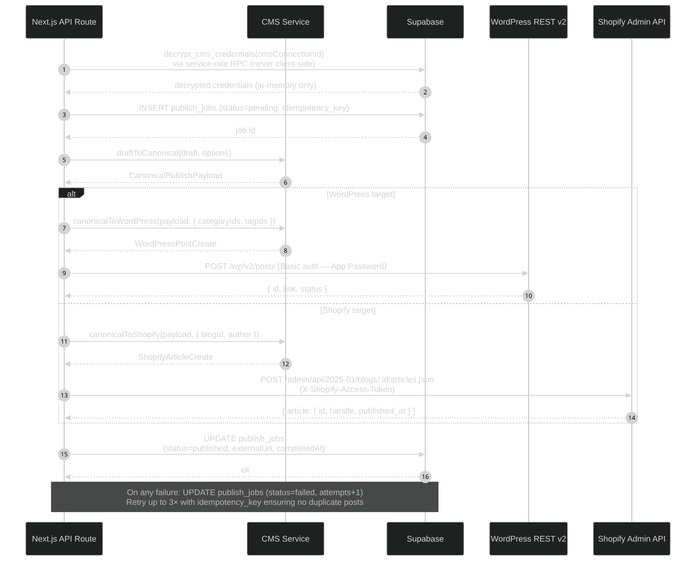

<p align="center">
  
</p>

<h1 align="center">SEOBot — AI Content & SEO Pipeline</h1>

<p align="center">
  <strong>Production-architecture showcase · TypeScript · Next.js 16 · Supabase · WordPress & Shopify</strong>
</p>

<p align="center">
  
  
  
  
  
  
</p>

---

## The problem this solves

Content teams at agencies and e-commerce brands spend **hours per article** doing what a machine can do in seconds: researching SERP structure, writing to H1/H2/H3 hierarchy, checking keyword density and readability, then copy-pasting into WordPress or Shopify. SEOBot automates the entire loop — from a single keyword phrase to a fully validated, CMS-ready article.

> **This repo is a portfolio-grade architecture skeleton.** It demonstrates the engineering discipline required to build this system at scale — typed pipeline stages, a weighted SEO validation engine, dual-CMS adapters, and a security-hardened data layer. The AI prompts and operator configuration live outside this repo (the proprietary methodology layer).

---

## What it does

<p align="center">
  
</p>

One keyword phrase enters. A validated, CMS-published article comes out.

| Stage | What happens |
|---|---|
| **1 · Research** | SERP competitor analysis — headings, entities, search intent classification |
| **2 · Outline** | H1/H2/H3 hierarchy, meta description draft, slug, target word count, schema.org type |
| **3 · Draft** | Full article body with suggested internal links, reading time, word count |
| **4 · SEO Audit** | 10-rule weighted validator → 0–100 score with pass/warn/fail per rule |
| **5 · Publish** | One-click to WordPress REST API v2 **or** Shopify Admin API — typed, idempotent |

---

## Live SEO Validation Dashboard

<p align="center">
  
</p>

The validator runs **10 independent rules**, each with a weighted contribution to the overall 0–100 score:

| Rule | What it checks |
|---|---|
| H1 Length | 30–70 chars ideal; warns 71–100; fails outside range |
| H1 Keyword | Exact phrase match → pass; partial coverage → warn; absent → fail |
| Meta Description | 150–160 chars ideal; keyword presence |
| Keyword Density | 0.8–2.5% target; stuffing detection above 3.5% |
| Flesch Readability | FRE ≥ 60 pass; 45–59 warn; < 45 fail |
| Heading Hierarchy | No skipped levels (H2 → H4 is a violation) |
| Internal Links | ≥ 2 unique root-relative hrefs required |
| Schema.org Type | Article / BlogPosting / HowTo / FAQPage / NewsArticle |
| Canonical URL | Must be absolute HTTPS; relative or HTTP → fail |
| Word Count | Minimum body length for reliable scoring |

---

## Architecture

<p align="center">
  
</p>

<p align="center">
  
</p>

| Layer | Stack | Key decision |
|---|---|---|
| **Framework** | Next.js 16 App Router + React 19 | Server Components for pipeline calls; client components for interactive UI |
| **Pipeline** | Pure TypeScript functions | Every stage returns `PipelineStageOutcome<T>` — typed success/error with duration |
| **SEO Engine** | Custom validator, `src/lib/seo/` | 10 rules, each independent + unit-tested; weighted scoring via `constants.ts` |
| **CMS Adapters** | `draftToCanonical()` → WP / Shopify | Canonical intermediary prevents coupling; both adapters typed against real API contracts |
| **Database** | Supabase PostgreSQL + RLS | AES-256-GCM envelope encryption on CMS credentials; idempotency keys on publish jobs |
| **Security** | `next.config.ts` headers + `server-only` | CSP, HSTS, X-Frame-Options; credentials never bundled to client |
| **Tests** | Vitest 4 | 121 tests · CMS adapter round-trips · SEO rule edge cases · `npm audit` 0 CVEs |

---

## Database Schema

<p align="center">
  
</p>

9 tables · Row-Level Security on every table · Workspace-scoped access · Envelope-encrypted CMS credentials

---

## CMS Publish Sequence

<p align="center">
  
</p>

---

## What this demonstrates (for hiring managers & technical leads)

This project was built to showcase production-level TypeScript discipline across a full AI product surface:

**Type System**
- `noUncheckedIndexedAccess` + `noImplicitOverride` — strictest tsc profile
- `PipelineStageOutcome<T>` propagates typed results through all 5 stages
- `Exclude<SeoVerdict, 'pending'>` narrows the `SEOReport.verdict` union — only valid post-scoring
- `WordPressPostCreate` / `ShopifyArticleCreate` typed against real API contracts

**Security Engineering**
- `import 'server-only'` on every credential-touching module — build-time enforcement
- HTML entity escaping on all AI-generated content before CMS injection (XSS prevention)
- AES-256-GCM envelope encryption for CMS credentials at rest
- SHOPIFY_SHOP regex prevents trailing-hyphen subdomains (validation hardening)
- CSP, HSTS, X-Frame-Options, X-Content-Type-Options headers in `next.config.ts`

**Test Quality (121 tests)**
- Semantic edge cases: empty keyword guard (`String.includes('')` always `true`)
- Regex correctness: sentence boundary lookahead vs. `$` inside `[]`
- Protocol-relative URL classification (`//cdn.example.com` is external, not internal)
- CMS adapter round-trip: `Draft → Canonical → WP + Shopify` — both outputs preserve meta description
- Fixture structural checks: JSON fixtures cast to TypeScript types at compile time

**Clean Architecture**
- Canonical intermediary pattern: `draftToCanonical()` decouples pipeline from CMS-specific shapes
- Single-branch conditional spreads in `canonicalToWordPress()` — no duplicate optional-field logic
- `WEIGHTS` integrity enforced unconditionally at module load (not only in dev)

---

## Quick Start

No credentials needed. Everything runs in skeleton/stub mode.

```bash
git clone https://github.com/RexOwenDev/seobot.git
cd seobot
npm install
npm run type-check   # tsc --noEmit — clean
npm test             # 121 tests, ~1s on Vitest 4
npm audit            # 0 vulnerabilities
```

---

## Stack

| | |
|---|---|
| Framework | Next.js 16 App Router + React 19 |
| Language | TypeScript 5.9 strict |
| Styling | Tailwind v4 + shadcn/ui (zinc, new-york) |
| Database | Supabase PostgreSQL (RLS + envelope encryption) |
| AI Gateway | Vercel AI SDK → Claude Sonnet 4.6 (stubbed) |
| CMS | WordPress REST API v2 · Shopify Admin API 2025-01 |
| Tests | Vitest 4.1 · 121 passing · 0 CVEs |
| Deployment | Vercel Fluid Compute (Node.js 24) |

---

## Feature Tiers

| | Starter | **Agency** | Enterprise |
|---|---|---|---|
| Keywords / month | 25 | **Unlimited** | Unlimited |
| Articles / month | 50 | **500** | Unlimited |
| CMS connections | 1 | **10** | Unlimited |
| SEO validator | ✓ | **✓** | ✓ |
| Internal link graph | — | **✓** | ✓ |
| Custom brand voice | — | **✓** | ✓ |
| White-label dashboard | — | — | ✓ |
| SLA | — | — | 99.9% |
| **Price** | $49/mo | **$199/mo** | Custom |

> Pricing is indicative. This repo demonstrates the architecture — the operator methodology (prompts, scoring weights, brand voice engine) is the proprietary layer.

---

## FAQ

**Why is the AI stubbed?**
The prompts and scoring weights are the operator methodology — the proprietary, monetizable layer. The skeleton shows every contract that layer must fulfill: exact TypeScript types, stage interfaces, validation thresholds. You can see exactly what to build.

**Why 121 tests on a skeleton?**
Because the test suite documents every non-obvious edge case in the system's correctness guarantees. Each test corresponds to a real bug pattern: `String.includes('')` always returns `true`, `$` inside `[]` is a literal character, protocol-relative URLs resolve externally. These are the kinds of bugs that ship silently without tests.

**Is this production-ready?**
The architecture is production-grade. Wiring it up requires: AI Gateway credentials (Vercel/Anthropic), prompt templates, CMS Application Passwords, Supabase project config, and deployment to Vercel. See [SETUP.md](SETUP.md).

---

## License

MIT — see [LICENSE](LICENSE).

---

<p align="center">
  Built by <a href="https://github.com/RexOwenDev"><strong>RexOwenDev</strong></a> · Portfolio showcase · AI × TypeScript × CMS automation
</p>
